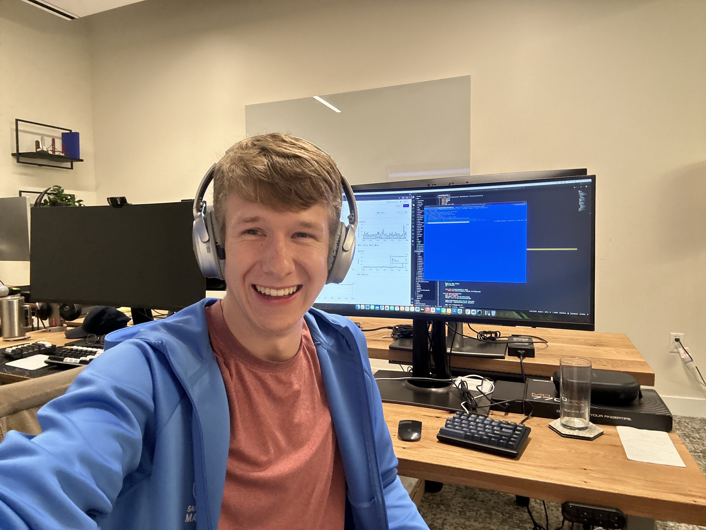

# About Me

I am currently a Codepoint Fellow at Sutter Hill Ventures working at a stealth startup in the Bay Area.

In college I spent most of my time solving programming and math problems for fun.

In my free time I enjoy learning new things and running... well, I don't know if I _enjoy_ running, but I certainly do it haha.
I recently completed my first marathon, **_The San Francisco Marathon_**, with a time of 3:11.
I am also learning how to play the piano, current piece: Bach's **_G Minor_**.

The most recent book I read is **_Living With a SEAL_** by Jesse Itzler (feat. David Goggins)

Oh also, I'm a big Seinfeld fan haha.

