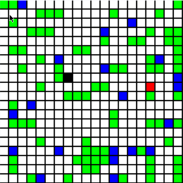
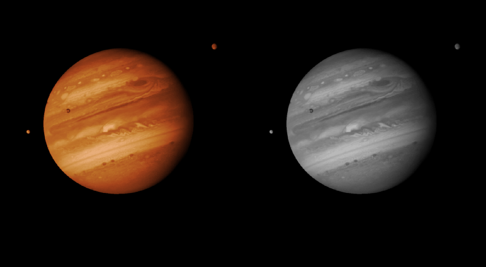

# Projects

## [gitgud.cc](https://www.gitgud.cc/)

A platform for my friends and I to share our favorite problems with the world
[CF-Blog](https://codeforces.com/blog/entry/141486)
[Tweet](https://x.com/cam_custer/status/1908623187086369276)

## [Programming Team Code](https://github.com/programming-team-code)

An algorithmic library for solving programming problems maintained in both rust and c++

## [I Beat Rock](https://github.com/cameroncuster/I_beat_rock)

[@camc on the leaderboard](https://www.whatbeatsrock.com/leaderboard-all)

Developed a strategy and implemented a bot to play [What Beats Rock](https://www.whatbeatsrock.com/)

## [Eventhub](https://www.eventhub.news/)

Bringing the world's information to you while letting you decide what to believe

## [2048 Player](https://github.com/cameroncuster/2048_player)

An AI player for the game 2048, featuring:

- Predictive algorithm simulating 5-7 future moves
- Custom heuristic function for board state evaluation
- Performance optimization through memoization and pruning

## [Snake Player](https://github.com/cameroncuster/snake_player)

A Snake game AI utilizing graph traversal algorithms, particularly AStar for pathfinding

Highlights:

- Demonstrates emergent behaviors
- Achieves near-perfect scores on various grid sizes and obstacle configurations

## [Quadtree Image Compression](https://github.com/cameroncuster/quadtree_image_compression)

Image compression tool using Quadtree structure, emphasizing:

- Test-Driven Development (TDD)
- Object-oriented design principles
- Modular architecture for use as a standalone library
- Applicability to both image and video compression

---

I totally didn't ask an LLM to write this 😉
