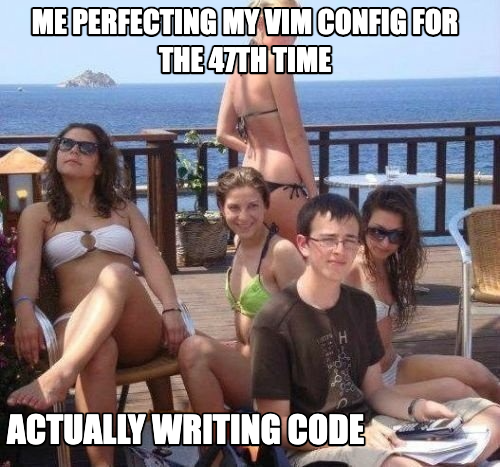

Recently, I've been encouraging many of my SWE & non-SWE friends to level up their game when it comes to setup, so I figured I'd jot some things down here.

With my setup you'll notice a common theme: I like vim. It's a matter of taste, but my setup is oriented around vim everything. ([Learn vim](https://vim-adventures.com/))

**TL;DR:** Using the mouse is slow, inefficient, and imprecise. For most of us (sorry gamers), the mouse is actually completely useless, and we can do everything with the keyboard.

Of course, you should probably have a nice keyboard in that case. [My current layout](https://configure.zsa.io/ergodox-ez-st/layouts/Dq7WZ/latest/0)

1. **Most of our time on the computer is spent in the browser (let's optimize that):** This one is the biggest productivity boost for most people, especially when considered proportional to the learning curve - [Vimium](https://vimium.github.io/)

2. **We need to be able to manage our windows using the keyboard:** [AeroSpace](https://github.com/nikitabobko/AeroSpace) - similar to i3 for macOS

3. **My configuration:** [My cfg](https://github.com/cameroncuster/cfg) (vim terminal, neovim, vim extension in VS Code). For setting up dotfiles, check out [this](https://news.ycombinator.com/item?id=11070797)

